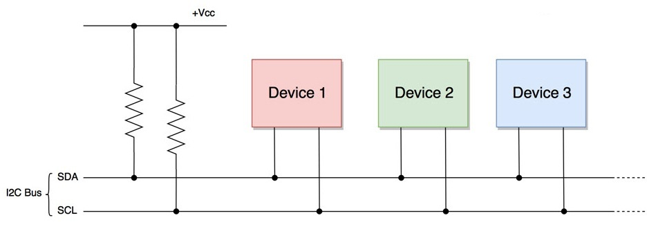
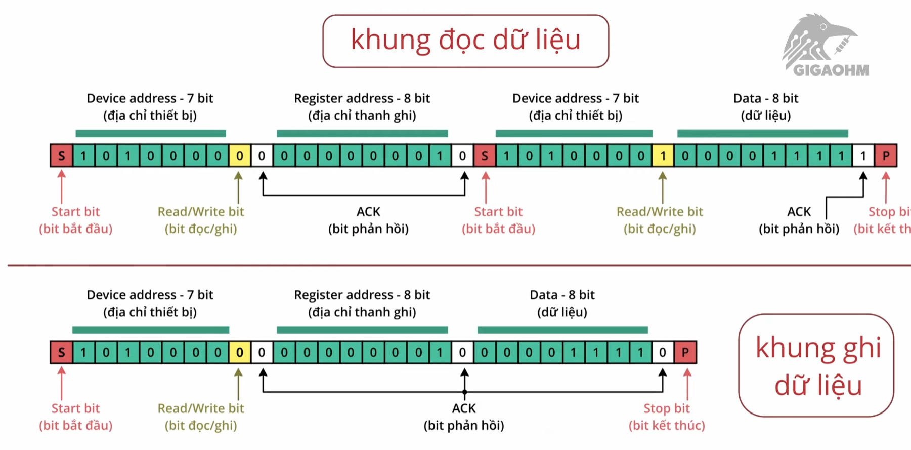
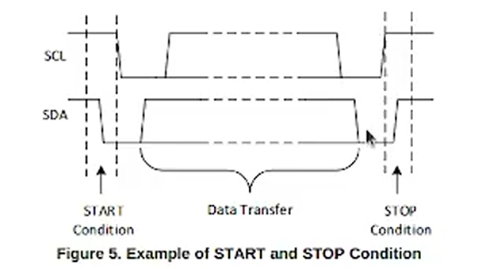
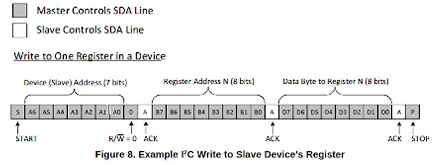
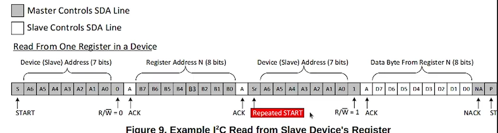
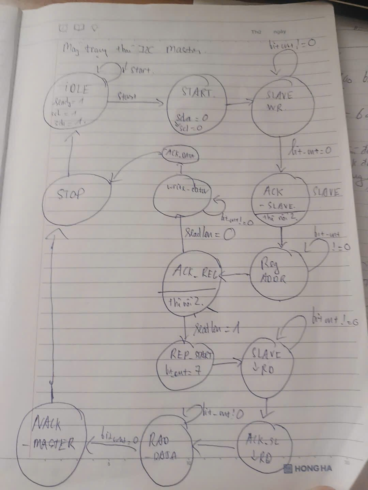
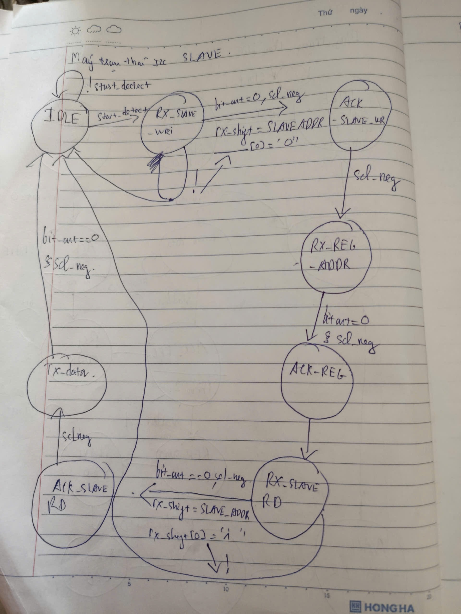
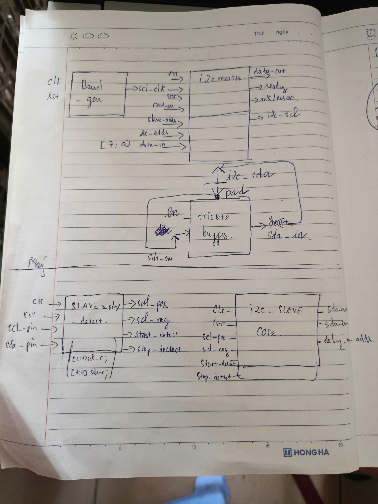
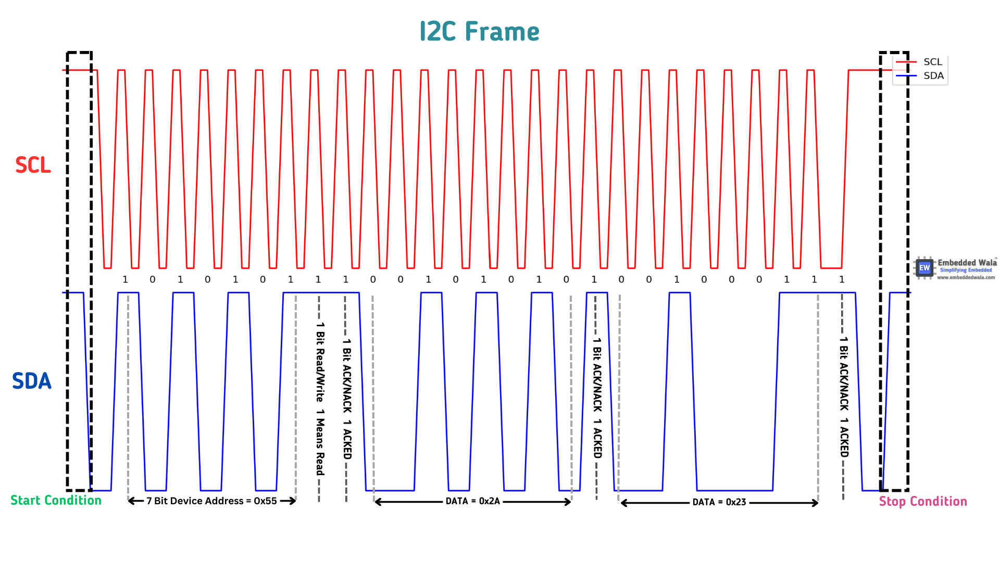
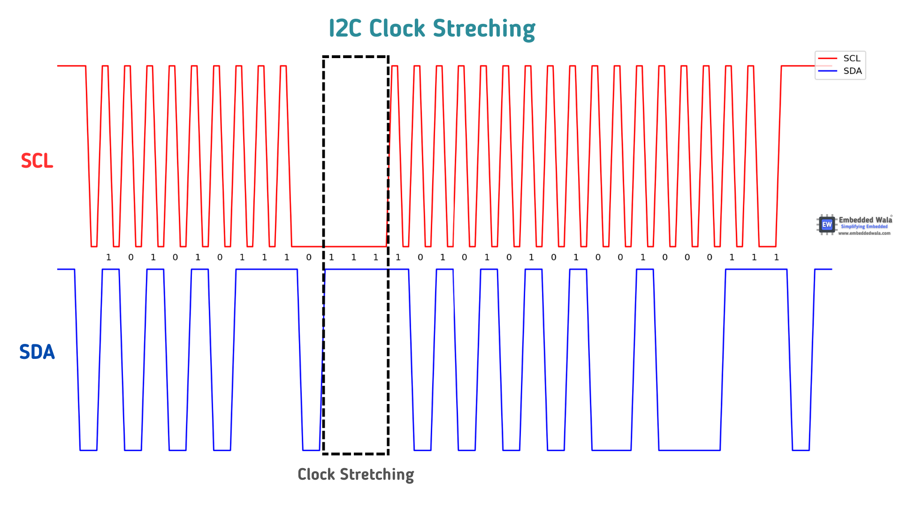

# ELE-D24-NguyenTrungHieu
## A. KIẾN THỨC TÌM HIỂU ĐƯỢC
### 1. I2C protocol (Inter-Integrated Circuit)
#### 1.1 Khái niệm

- I2C (Inter-Integrated Circuit): là giao thức truyền thông nối tiếp đồng bộ sử dụng 2 dây SDA và SCL để kết nối nhiều thiết bị Master và Slave trên cùng 1 bus.

- standard mode: 100 Khz.

- fast mode: 400 khz.

#### 1.2 Bus vật lý I2C

- Cả hai đường dây I2C (SDA và SCL) đều được cấu hình cực máng hở open-drain. Nó có nghĩa là bất kỳ thiết bị / IC trên mạng I2C có thể lái SDA và SCl xuống mức thấp, nhưng k thể lái chúng lên mức cao. Vì vậy, cần một điện trở kéo lên (1k hoặc 4,7k) được sử dụng cho mỗi đường bus, để giữ cho chúng ở mức điện áp cao.

- Lý do sử dụng một hệ thống cực máng hở (open drain) là để không xảy ra hiện tượng ngắn mạch, điều này có thể xảy ra khi một thiết bị cố gắng kéo đường dây lên cao và một số thiết bị khác cố gắng kéo đường dây xuống thấp.

#### 1.3 Tri state buffer

| X | enable | Y |
|------|-------|------|
| X | 0 | HIGH Z |
| 0 | 1 | 0 |
| 1 | 1 | 1 |

- tri_state_buffer để cho SLAVE lái khi SDA Master thẻ nổi high Z.

#### 1.4 Khung truyền dữ liệu

##### 1.4.1 Start and Stop Condition

- START: SDA kéo xuống 0 trước khi SCL kéo xuống 0.

- STOP: SCL kéo lên 1 trước khi SDA kéo lên 1.

##### 1.4.2 DATA transfer condition

- SDA thay đổi mỗi khi SCL đang ở mức 0.

- SDA ổn định khi SCL đang ở mức 1.

##### 1.4.3 ACK ( Acknowledge) và NACK (Not Acknowledge)

- Mỗi byte truyền đi bao gồm byte dữ liệu và byte địa chỉ

- ACK = 0 cho bit sender biết rắng byte nhận được 1 cách thành công (SLAVE kiểm soát).

- NACK = 1 khi MASTER không muốn nhận dữ liệu từ SLAVe nữa (MASTER kiểm soát).

##### 1.4.4 Writing to SLAVE on the FC bus

##### 1.4.5 Reading from SLAVE on the FC bus

#### 1.5 State machine and block diagram

- MASTER: 

- SLAVE:

- Block Diagram

#### 1.6 Clock stretching

- One of the important features of I2C protocol is clock stretching, which is used to temporarily halt the master's clock signal by a slave device until it's ready to continue with the transmission. Clock stretching allows the slave device to have control over the timing of the communication and enables it to request more time to complete its operation. 

- In I2C communication, the master device generates the clock signal which is used to synchronize the communication between the devices. The master device controls the data transmission by sending the start and stop signals, and it determines the clock frequency for the communication. The slave devices, on the other hand, respond to the master's commands by sending or receiving data on the data lines. 

- When a slave device needs more time to process the data or is not ready to send data, it can hold the clock signal low, which is known as clock stretching. In this case, the slave device holds the SCL (Serial Clock) line low while keeping the SDA (Serial Data) line high. The master device detects this condition and waits for the slave device to release the clock signal before continuing with the communication. 

- The clock stretching technique allows slave devices to slow down the communication speed and temporarily suspend the communication with the master device. This can be useful in scenarios where the slave device needs more time to complete its operation or if there is a delay in the response due to some external factors. Clock stretching is an essential feature in I2C communication, especially in scenarios where different devices have varying processing speeds or when one device is slower than the other. 
