# ELE_D24_Nguyen Trung Hieu
## A. Kiến thức tìm hiểu được
### 1. Định lý lấy mẫu nyquyst
- Trong tự nhiên tín hiệu là liên tục analog nhưng máy tính chỉ hiểu 0 1. Do đó ta cần 1 bộ ADC để chụp tín hiệu theo khoảng thời gian đều đặn và ghép chúng lại.    
- Tấn số lấy mẫu fs: là số lần tín hiệu chụp được trong 1s (vd: fs = 200 tức là trong 1s sẽ chụp được 200 mẫu).
- Định lý Nyquist: để khôi phục tín hiệu mà không bị méo dạng (hiện tượng chồng phổ aliasing), tần số lấy mẫu fs phải lớn hơn ít nhất 2 lần tần số lớn nhất trong tín hiệu gốc.

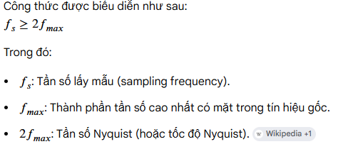

### 2. Một vài khái niệm liên quan đến bộ lọc
#### 2.1 Phương trình sai phân 

-  phương trình sai phân bộ lọc 15 taps

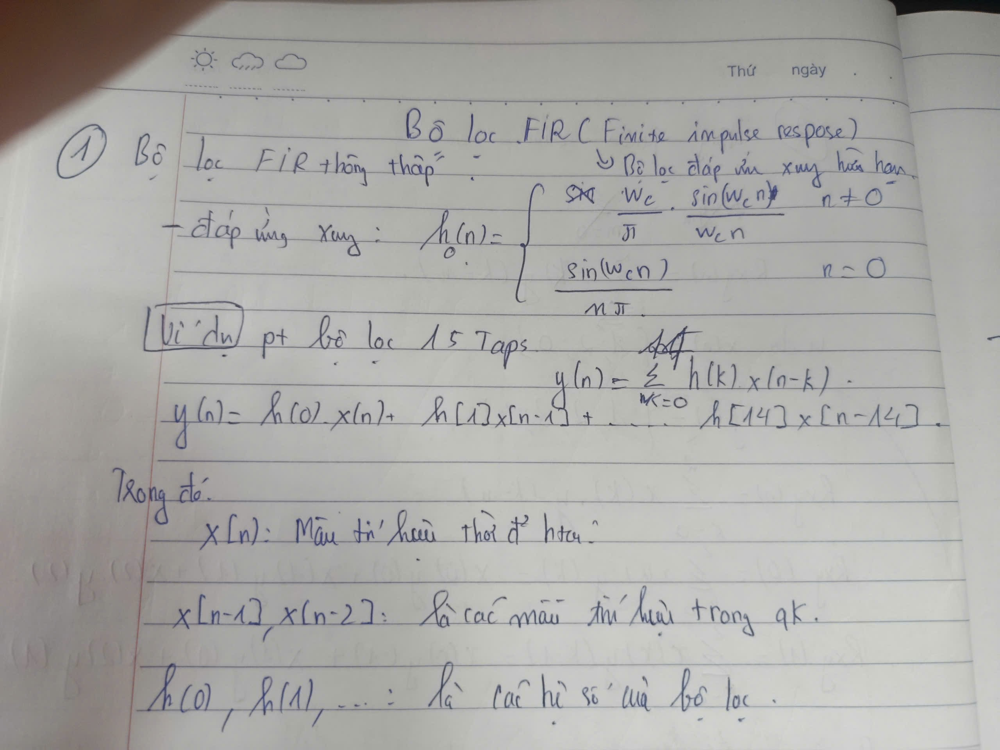

#### 2.2 Tần số cắt
- là ranh rới giữa vùng tần số được giữ lại và tần số bỏ đi 
     - ví dụ bộ lọc thông thấp fc = 15hz thì nhứng tín hiệu nào nhỏ hơn 15hz lớn hơn (-15hz) sẽ được giữ lại.
#### 2.3 Hàm cửa sổ
- Mục đích của hàm cửa số là tạo ra những hệ số bộ lọc để đem đi nhân tích chập với x(n) tùy thuộc từng loại cửa số thì sẽ tạo ra từng đồ thị khác nhau, và mục đích khác nhau
- Ta có các hàm cửa sổ sau:
#### 2.3.1 Cửa sổ chữ nhật 
     
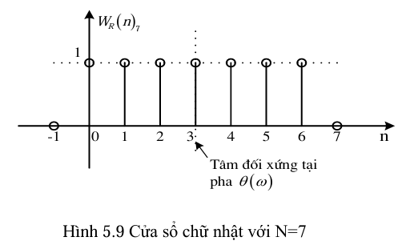

#### 2.3.2 Cửa sổ ballet

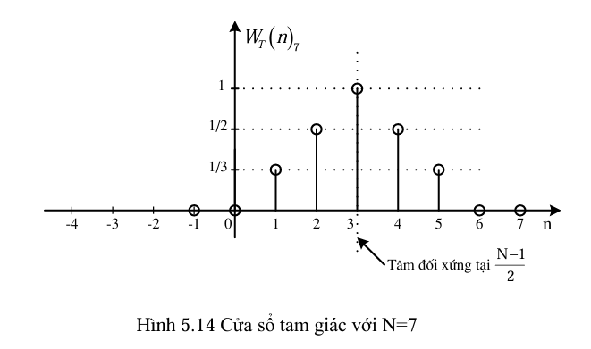

#### 2.3.3 Cửa sổ hamming và hanning

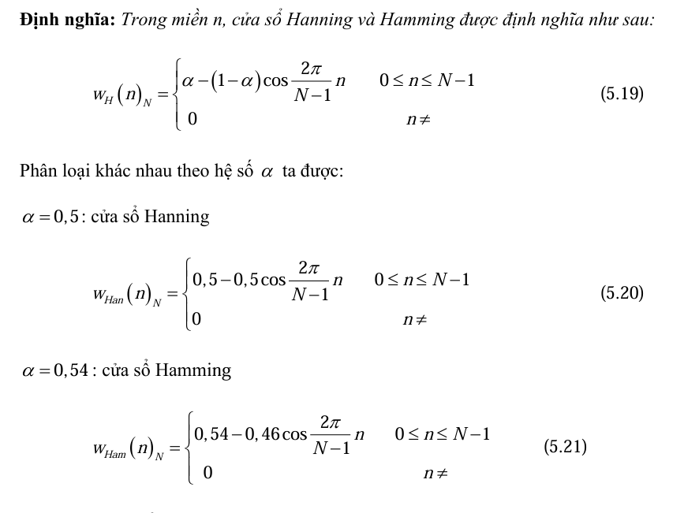

#### 2.3.4 Cửa sổ blackman

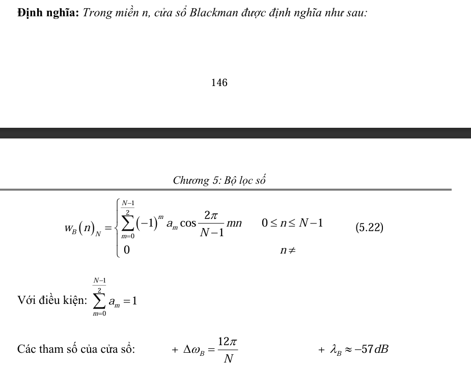
### 2.4 Thanh ghi lưu trữ

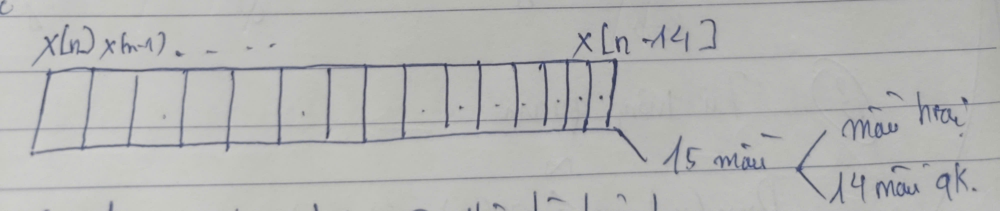

-  Gỉa sử ta có 200 mẫu tín hiệu mỗi lần gõ nhịp xung clock dữ liệu mới lọt vào vị trí x(n) rồi đến nhịp tiếp theo cứ thế các mẫu dịch sang phải (siding window).
-  Bộ lọc không nhìn vào 1 tín hiệu x(n) tại một thời điểm mà nó nhìn vào thanh ghi gồm 15 mẫu thực hiện phép chập cộng và nhân để lọc trung bình. ( thực hiện cộng trung bình có trọng số từ hàm cửa sổ ).

## 3. Bộ lọc thông thấp (Low pass filter)
### 3.1 Đáp ứng biên độ của bộ lọc.

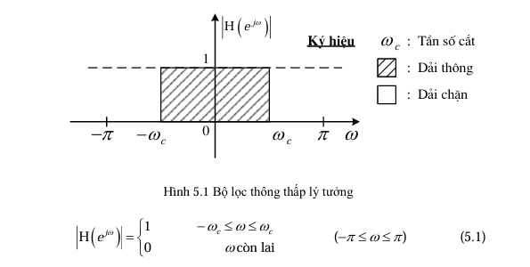

### 3.2 Đáp ứng xung của bộ lọc.
- image

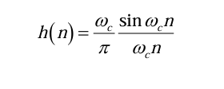 

### 3.3 Mô phỏng bộ lọc thông thấp
- Bộ lọc 15 taps với cửa sổ hamming

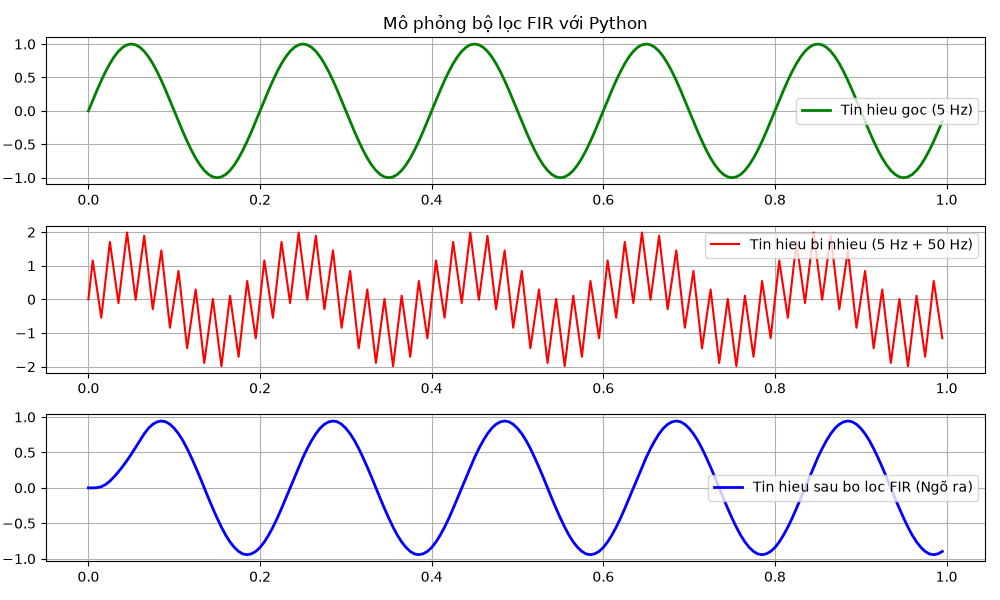

- Bộ lọc 15 taps với cửa sổ chữ nhật

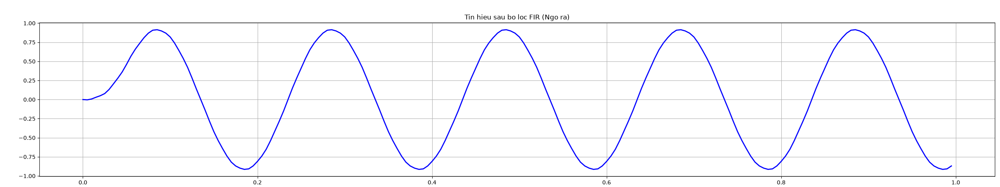

- Bộ lọc thông thấp với cửa sổ barlett

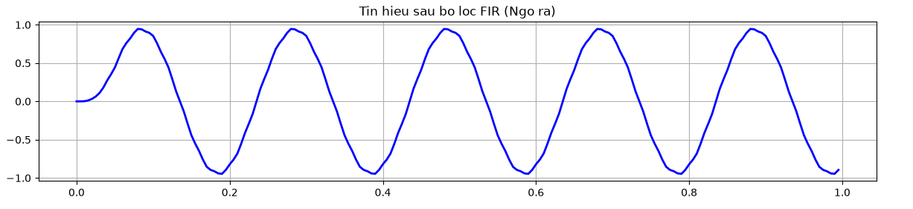
## 4. Bộ lọc thông cao (High pass filter)
### 4.1 Đáp ứng biên độ

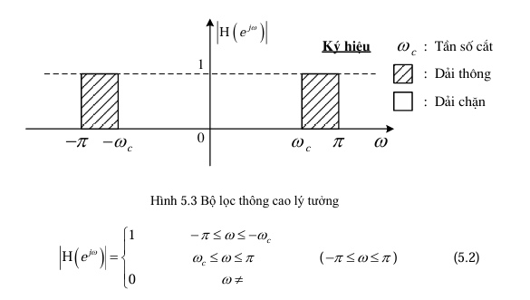

### 4.2 Đáp ứng xung 

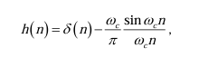

### 4.3 Mô phỏng bộ lọc thông thấp

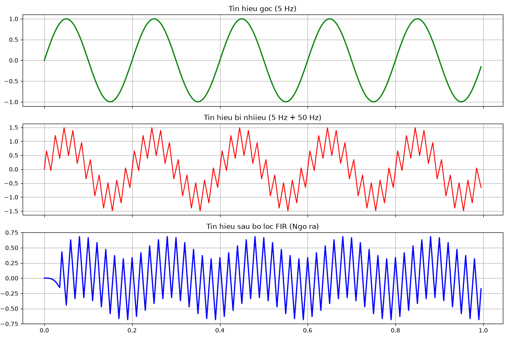

## B. Bài tập đã làm
### 1. Bộ lọc FIR thông thấp
- code: 
```v
module low_pass_filter_pipeline #(
    parameter DATA_WIDTH = 16, 
    parameter COEF_WIDTH = 16, 
    parameter EXP_WIDTH  = 36, 
    parameter TAP        = 15  
)(
    input  wire                   clk,
    input  wire                   rst,
    input  wire signed [DATA_WIDTH-1:0] data_in,
    output reg  signed [DATA_WIDTH-1:0] data_out
);

    // 1. CHỈ CẦN KHAI BÁO 8 HỆ SỐ (Vì các hệ số sau đối xứng hoàn toàn)
    localparam signed [COEF_WIDTH-1:0] H_0 = -16'sd22;
    localparam signed [COEF_WIDTH-1:0] H_1 = 16'sd78;
    localparam signed [COEF_WIDTH-1:0] H_2 = 16'sd432;
    localparam signed [COEF_WIDTH-1:0] H_3 = 16'sd1254;
    localparam signed [COEF_WIDTH-1:0] H_4 = 16'sd2549;
    localparam signed [COEF_WIDTH-1:0] H_5 = 16'sd4031;
    localparam signed [COEF_WIDTH-1:0] H_6 = 16'sd5222;
    localparam signed [COEF_WIDTH-1:0] H_7 = 16'sd5679; // Hệ số tâm

    // 2. MẠNG DỊCH TRỄ (Giữ nguyên để lưu 15 mẫu)
    reg signed [DATA_WIDTH-1:0] x [0:TAP-1];
    integer i;

    always @(posedge clk or posedge rst) begin
        if (rst) begin
            for (i = 0; i < TAP; i = i + 1) begin
                x[i] <= {DATA_WIDTH{1'b0}};
            end
        end
        else begin
            for (i = TAP-1; i > 0; i = i - 1) begin
                x[i] <= x[i-1];
            end
            x[0] <= data_in;
        end
    end

    // 3. KHỐI CỘNG TRƯỚC (PRE-ADDERS)
    // Cộng hai số 16-bit signed -> Kết quả cần 17-bit để tránh tràn số
    wire signed [DATA_WIDTH:0] sum_reg [0:6];
    
    assign sum_reg[0] = x[0] + x[14];
    assign sum_reg[1] = x[1] + x[13];
    assign sum_reg[2] = x[2] + x[12];
    assign sum_reg[3] = x[3] + x[11];
    assign sum_reg[4] = x[4] + x[10];
    assign sum_reg[5] = x[5] + x[9];
    assign sum_reg[6] = x[6] + x[8];

    // 4. KHỐI NHÂN TỐI ƯU (Chỉ tốn 8 bộ nhân thay vì 15)
    wire signed [(DATA_WIDTH + COEF_WIDTH):0] p [0:7];
    
    assign p[0] = sum_reg[0] * H_0;
    assign p[1] = sum_reg[1] * H_1;
    assign p[2] = sum_reg[2] * H_2;
    assign p[3] = sum_reg[3] * H_3;
    assign p[4] = sum_reg[4] * H_4;
    assign p[5] = sum_reg[5] * H_5;
    assign p[6] = sum_reg[6] * H_6;
    assign p[7] = x[7]        * H_7; // Thằng ở giữa đứng một mình

    // 5. Pipeline adder tree chia thành 4 2 1
    reg signed [33:0] r1_0, r1_1, r1_2, r1_3; // tầng 1
    reg signed [34:0] r2_0,r2_1; // tầng 2
    reg signed [35:0] r3_sum; // tầng 3
    always @(posedge clk or posedge rst) begin
        if (rst) begin
            r1_0 <= 0;
            r1_1 <= 0;
            r1_2<= 0;
            r1_3<= 0;
            r2_0 <= 0;
            r2_1 <= 0;
            r3_sum <= 0; 
        end
        else begin
            // tầng 1
            r1_0 <= p[0] + p[1];
            r1_1 <= p[2] + p[3];
            r1_2 <= p[4] + p[5];
            r1_3 <= p[6] + p[7];
            // tầng 2
            r2_0 <= r1_0 + r1_1;
            r2_1 <= r1_2 + r1_3;
            // tầng 3
            r3_sum <= r2_0 + r2_1;
        end
    end
    // 6. ĐẦU RA VÀ ĐỊNH DẠNG FIXED-POINT
    always @(posedge clk or posedge rst) begin
        if (rst) begin
            data_out <= {DATA_WIDTH{1'b0}};
        end
        else begin
            // Trích xuất lấy 16 bit thực tế sau khi đã chia scale factor (2^15)
            data_out <= r3_sum[15 + DATA_WIDTH - 1 : 15];
        end
    end
endmodule
```
- tb
```v
`timescale 1ns / 1ps

module tb_low_pass_filter;

    parameter DATA_WIDTH = 16;
    parameter COEF_WIDTH = 16;
    parameter EXP_WIDTH  = 36;
    parameter TAP        = 15;

    reg                     clk;
    reg                     rst;
    reg  signed [DATA_WIDTH-1:0] data_in;
    wire signed [DATA_WIDTH-1:0] data_out;

    // Khai báo một mảng bộ nhớ (Memory Array) trong Testbench để chứa 200 mẫu dữ liệu
    reg [DATA_WIDTH-1:0] test_memory [0:199];
    
    // Các biến phục vụ việc đọc/ghi file
    integer i;
    integer file_out; // Con trỏ file đầu ra

    // Gọi mạch DUT
    low_pass_filter #(
        .DATA_WIDTH(DATA_WIDTH),
        .COEF_WIDTH(COEF_WIDTH),
        .EXP_WIDTH(EXP_WIDTH),
        .TAP(TAP)
    ) uut (
        .clk(clk),
        .rst(rst),
        .data_in(data_in),
        .data_out(data_out)
    );

    // Tạo clock 100MHz
    always begin
        #5 clk = ~clk;
    end

    initial begin
        // 1. ĐỌC FILE DỮ LIỆU TỪ PYTHON VÀO BỘ NHỚ TESTBENCH
        // Hãy đảm bảo file input_signal.txt nằm cùng thư mục chạy mô phỏng của ModelSim/Vivado
        $readmemh("input_signal.txt", test_memory);

        // 2. MỞ FILE ĐỂ GHI KẾT QUẢ ĐẦU RA
        file_out = $fopen("output_signal.txt", "w");
        if (file_out == 0) begin
            $display("LỖI: Không thể tạo file output_signal.txt");
            $finish;
        end

        // Khởi tạo hệ thống
        clk = 0;
        rst = 1;
        data_in = 0;
        #20;
        rst = 0; // Nhả reset
        #10;

        // 3. NHỒI ĐỒNG LOẠT 200 MẪU VÀO BỘ LỌC
        $display("START: Đang đẩy dữ liệu từ file vào bộ lọc...");
        for (i = 0; i < 200; i = i + 1) begin
            @(posedge clk); // Đợi cạnh lên của clock
            data_in = test_memory[i]; // Đẩy dữ liệu vào mạch
            
            // Chờ 1 chu kỳ để mạch tính toán rồi ghi ngõ ra vào file text
            // Lưu dưới dạng số nguyên có dấu (%d) để Python đọc lại cho dễ
            $fwrite(file_out, "%d\n", data_out);
        end

        // Chờ thêm một chút cho các mẫu cuối trôi hết qua bộ lọc
        #100;
        
        // Đóng file kết quả
        $fclose(file_out);
        $display("FINISH: Đã ghi xong file output_signal.txt!");
        $stop;
    end

endmodule
```
- waveform

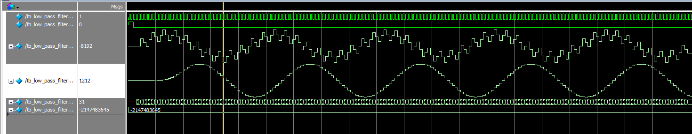

### 2. Bộ lọc FIR thông cao
- waveform

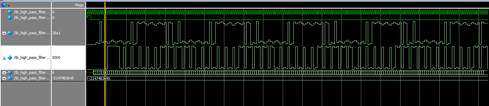