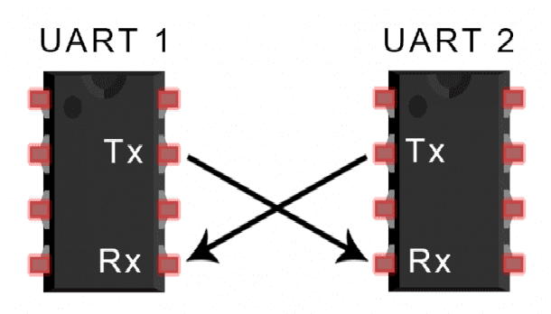
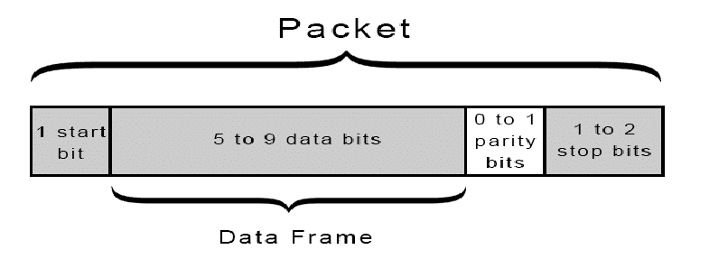
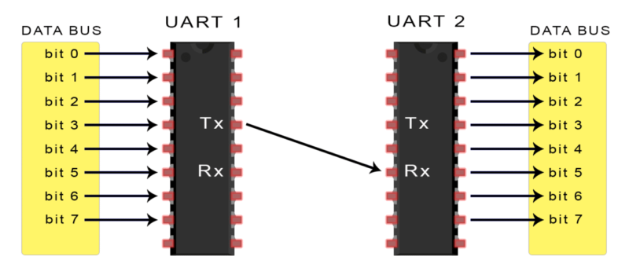
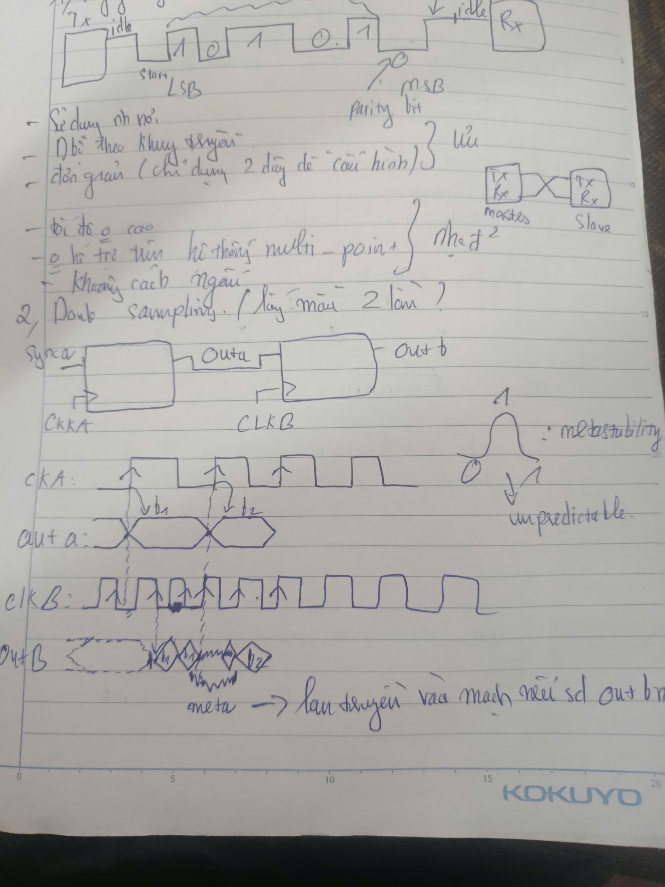
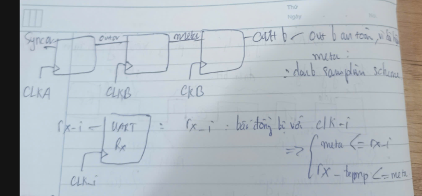
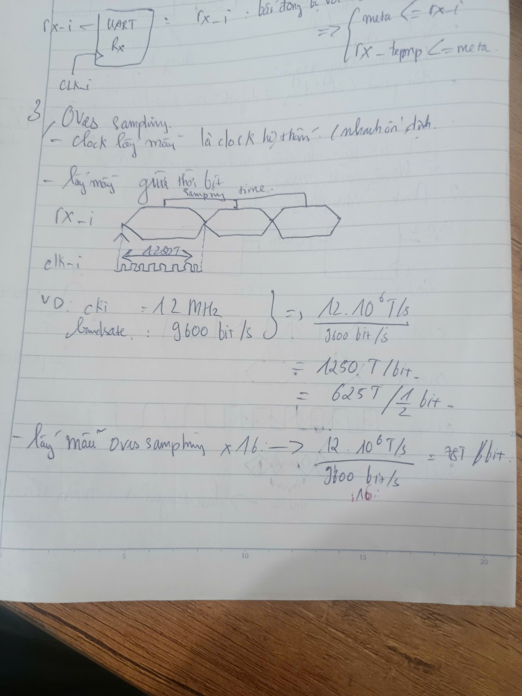
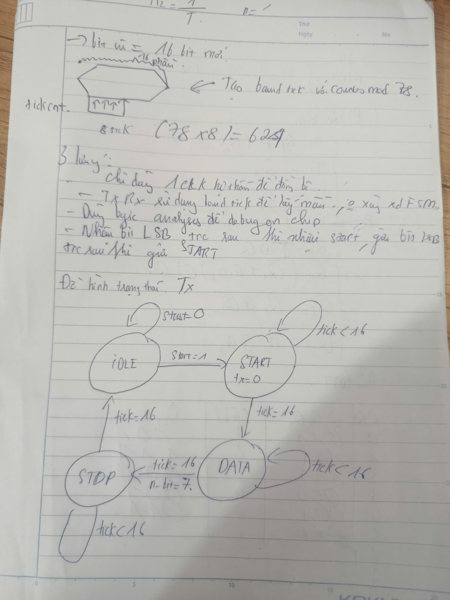

# ELE-D24-NguyenTrungHieu
## A. KIẾN THỨC TÌM HIỂU ĐƯỢC
### 1. UART (Universal Asynchronous Receiver-Transmitter)
- UART thuộc chế độ full duplex 
- Full Duplex là chế độ truyền dẫn 2 chiều nhưng ở kiểu này thì dữ liệu được truyền song song qua lại với nhau ( trong cùng 1 thời điểm tưởng tượng khi nói chuyện điện thoại ng nói và người nghe nói chuyện qua lại với nhau)
#### 1.1 Nguyên lý kết nối 

    UART sử dụng 2 dây tín hiệu chính:

    TX (Transmit): Chân truyền dữ liệu.

    RX (Receive): Chân nhận dữ liệu.

    GND: Phải nối chung mass giữa 2 thiết bị để có mức điện áp tham chiếu.

    Quy tắc: Kết nối chéo — TX của thiết bị này nối vào RX của thiết bị kia và ngược lại.
#### 1.2 Đặc điểm "Bất đồng bộ" (Asynchronous)
UART không có dây xung nhịp (Clock) để đồng bộ giữa 2 bên. Vì vậy, để hiểu nhau, hai thiết bị phải thống nhất trước một thông số gọi là Baudrate (Tốc độ bit).

    Các tốc độ phổ biến: 9600, 115200, 57600.

    Nếu Baudrate lệch nhau, dữ liệu nhận được sẽ bị lỗi (ký tự lạ/rác).
    - Bit rate là số bit truyền trong 1 giây.
    - Baud rate là số lần tín hiệu thay đổi trạng thái trong 1 giây
### 1.3 Cấu trúc khung dữ liệu (Data Frame)
Mỗi "gói" dữ liệu gửi đi qua UART có cấu trúc chuẩn như sau:

        Start Bit (1 bit): Luôn là mức thấp (0) để báo hiệu bắt đầu truyền.

        Data Frame (5-9 bits): Nội dung chính (thường là 8 bit - 1 byte).

        Parity Bit (0-1 bit): Dùng để kiểm tra lỗi (có thể có hoặc không).

        Stop Bit (1-2 bits): Luôn là mức cao (1) để báo hiệu kết thúc.
\
### 2. Double sampling\

### 3. Oversampling

## B. Bài tập đã làm
### 1. Viết module Tx, Rx, baud_gen
