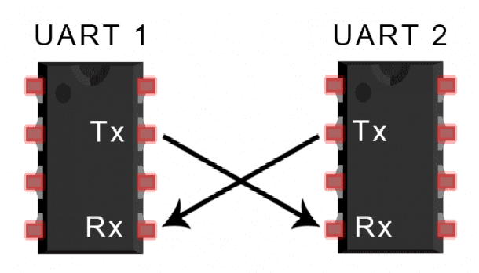
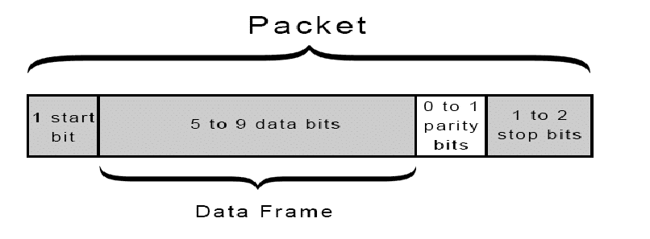
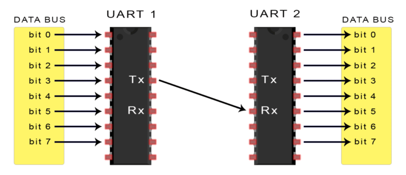
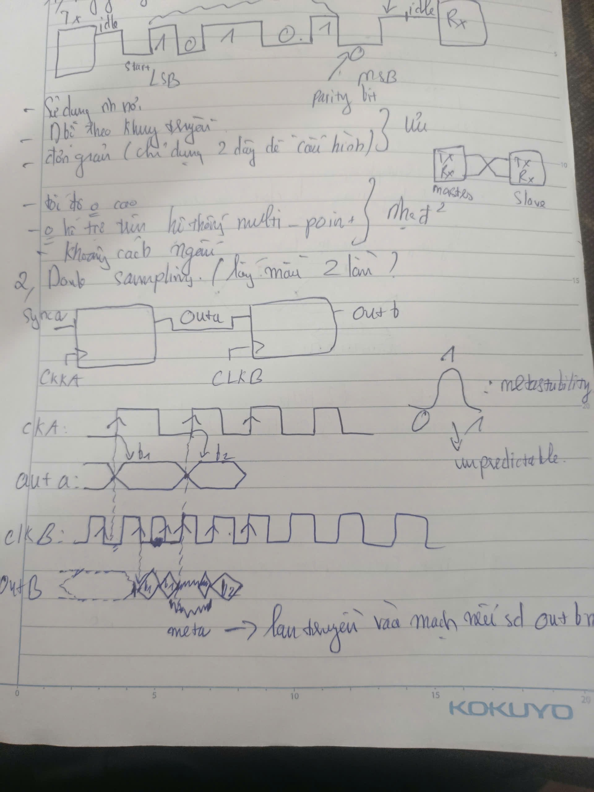
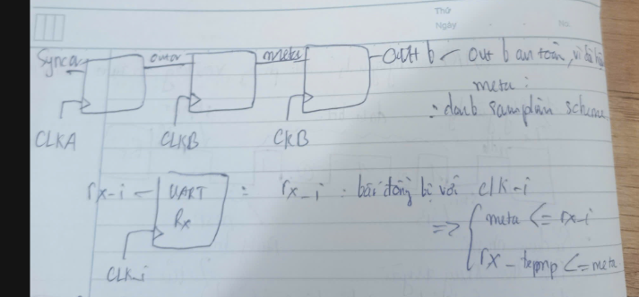
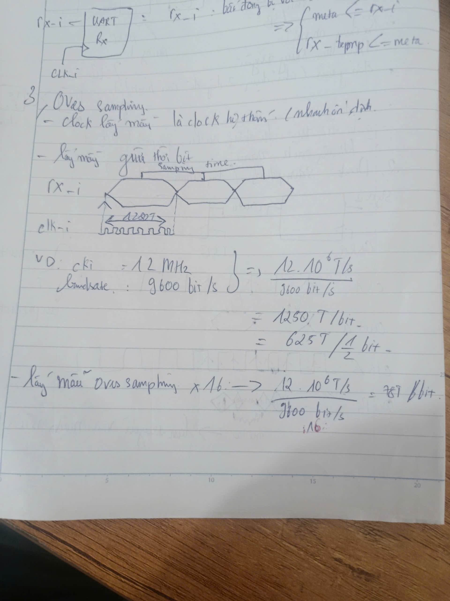
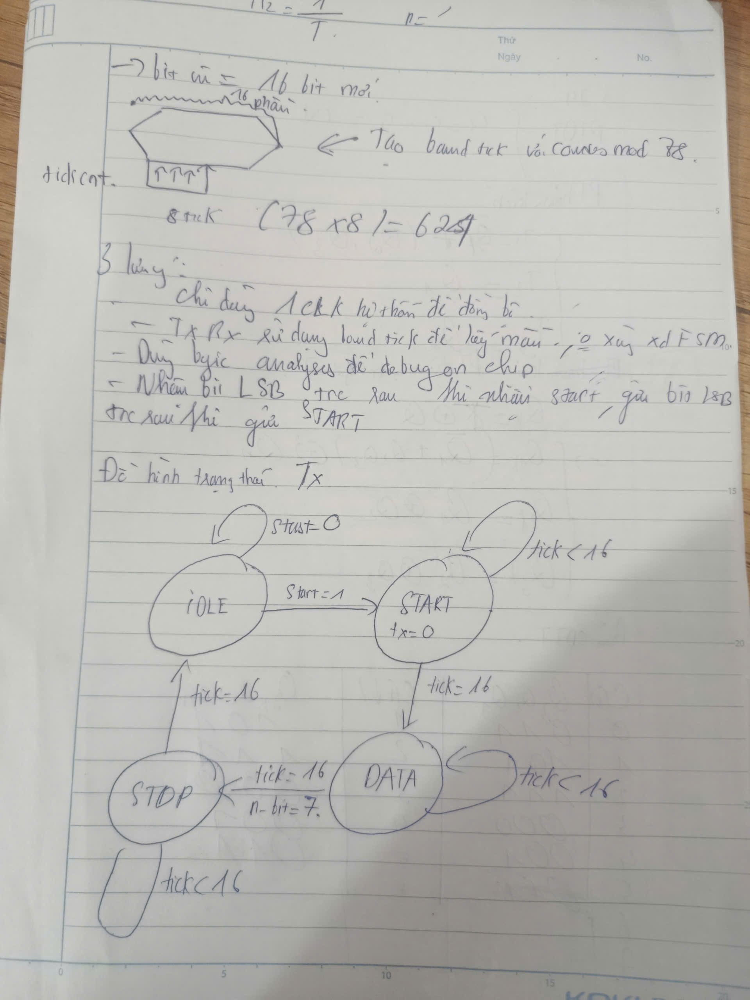

# ELE-D24-NguyenTrungHieu
## A. KIẾN THỨC TÌM HIỂU ĐƯỢC
### 1. UART (Universal Asynchronous Receiver-Transmitter)
- UART thuộc chế độ full duplex 
- Full Duplex là chế độ truyền dẫn 2 chiều nhưng ở kiểu này thì dữ liệu được truyền song song qua lại với nhau ( trong cùng 1 thời điểm tưởng tượng khi nói chuyện điện thoại ng nói và người nghe nói chuyện qua lại với nhau)
#### 1.1 Nguyên lý kết nối 

    UART sử dụng 2 dây tín hiệu chính:

    TX (Transmit): Chân truyền dữ liệu.

    RX (Receive): Chân nhận dữ liệu.

    GND: Phải nối chung mass giữa 2 thiết bị để có mức điện áp tham chiếu.

    Quy tắc: Kết nối chéo — TX của thiết bị này nối vào RX của thiết bị kia và ngược lại.
#### 1.2 Đặc điểm "Bất đồng bộ" (Asynchronous)
UART không có dây xung nhịp (Clock) để đồng bộ giữa 2 bên. Vì vậy, để hiểu nhau, hai thiết bị phải thống nhất trước một thông số gọi là Baudrate (Tốc độ bit).

    Các tốc độ phổ biến: 9600, 115200, 57600.

    Nếu Baudrate lệch nhau, dữ liệu nhận được sẽ bị lỗi (ký tự lạ/rác).
    - Bit rate là số bit truyền trong 1 giây.
    - Baud rate là số lần tín hiệu thay đổi trạng thái trong 1 giây
### 1.3 Cấu trúc khung dữ liệu (Data Frame)
Mỗi "gói" dữ liệu gửi đi qua UART có cấu trúc chuẩn như sau:

        Start Bit (1 bit): Luôn là mức thấp (0) để báo hiệu bắt đầu truyền.

        Data Frame (5-9 bits): Nội dung chính (thường là 8 bit - 1 byte).

        Parity Bit (0-1 bit): Dùng để kiểm tra lỗi (có thể có hoặc không).

        Stop Bit (1-2 bits): Luôn là mức cao (1) để báo hiệu kết thúc.
\
### 2. Double sampling\


### 3. Oversampling


## B. Bài tập đã làm
### 1. Viết module Tx, Rx, baud_gen
### 2. UART ESP TANGNANO 9K
- video: https://drive.google.com/drive/folders/1XZgoENMQcPuuqVvY2_9DZhsLycaGjnLz?usp=sharing
- code esp tx: 
```c
// Khai báo chân UART2 trên ESP32
#define RXD2 16
#define TXD2 17

void setup() {
  // Serial Debug máy tính
  Serial.begin(9600);
  
  // Serial2 giao tiếp với Tang Nano 9K (Baudrate 9600)
  Serial2.begin(9600, SERIAL_8N1, RXD2, TXD2);
  
  Serial.println("ESP32 UART Ready!");
}

void loop() {
  // Gửi lệnh BẬT LED (Ký tự '1')
  Serial.println("Gui lenh: BAT LED");
  Serial2.write('1');
  delay(2000); // Chờ 2 giây

  // Gửi lệnh TẮT LED (Ký tự '0')
  Serial.println("Gui lenh: TAT LED");
  Serial2.write('0');
  delay(2000); // Chờ 2 giây
}
```
- code tang nano rx:
```c
module baud_rate_generator (
    input clk,          // Clock hệ thống (27MHz)
    input reset,        // Reset tích cực cao
    output reg tick     // Xung tick cho Rx và Tx (gấp 16 lần Baud rate)
  );

  reg [7:0] counter; // 27MHz / (9600 * 16) = 175.78

  always @(posedge clk or posedge reset)
  begin
    if (reset)
    begin
      counter <= 0;
      tick <= 0;
    end
    else
    begin
      if (counter == 175)
      begin // Đếm từ 0 đến 175 là 176 chu kỳ
        counter <= 0;
        tick <= 1;
      end
      else
      begin
        counter <= counter + 1;
        tick <= 0;
      end
    end
  end
endmodule


module uart_rx (
    input clk,
    input reset,
    input rx,               // Chân Rx nối tiếp đầu vào
    input tick,             // Xung từ bộ Baud Rate Gen
    output reg rx_done_tick,// Báo hiệu đã nhận xong 1 byte
    output [7:0] dout       // Dữ liệu 8-bit đầu ra song song
  );

  localparam [1:0] IDLE  = 2'b00,
             START = 2'b01,
             DATA  = 2'b10,
             STOP  = 2'b11;

  reg [1:0] state_reg, state_next;
  reg [3:0] s_reg, s_next;       // Đếm tick (0-15)
  reg [2:0] n_reg, n_next;       // Đếm bit nhận (0-7)
  reg [7:0] d_reg, d_next;       // Thanh ghi lưu dữ liệu đang dịch vào

  always @(posedge clk or posedge reset)
  begin
    if (reset)
    begin
      state_reg <= IDLE;
      s_reg <= 0;
      n_reg <= 0;
      d_reg <= 0;
    end
    else
    begin
      state_reg <= state_next;
      s_reg <= s_next;
      n_reg <= n_next;
      d_reg <= d_next;
    end
  end

  always @*
  begin
    state_next = state_reg;
    s_next = s_reg;
    n_next = n_reg;
    d_next = d_reg;
    rx_done_tick = 1'b0;

    case (state_reg)
      IDLE:
      begin
        if (~rx)
        begin // Phát hiện cạnh xuống (Bit Start)
          state_next = START;
          s_next = 0;
        end
      end

      START:
      begin
        if (tick)
        begin
          if (s_reg == 7)
          begin // Lấy mẫu ở GIỮA bit Start
            state_next = DATA;
            s_next = 0;
            n_next = 0;
          end
          else
          begin
            s_next = s_reg + 1;
          end
        end
      end

      DATA:
      begin
        if (tick)
        begin
          if (s_reg == 15)
          begin // Lấy mẫu ở GIỮA bit dữ liệu (cứ sau mỗi 16 ticks)
            s_next = 0;
            d_next = {rx, d_reg[7:1]}; // Dịch bit nhận được vào MSB
            if (n_reg == 7)
              state_next = STOP;
            else
              n_next = n_reg + 1;
          end
          else
          begin
            s_next = s_reg + 1;
          end
        end
      end

      STOP:
      begin
        if (tick)
        begin
          if (s_reg == 15)
          begin // Đợi hết bit Stop
            state_next = IDLE;
            rx_done_tick = 1'b1; // Báo nhận thành công
          end
          else
          begin
            s_next = s_reg + 1;
          end
        end
      end
    endcase
  end

  assign dout = d_reg;
endmodule


module top (
    input wire clk,          // Clock 27MHz 
    input wire rst_n,        // Nút nhấn Reset S2 (Chân 4 - Tích cực mức thấp)
    input wire uart_rx_pin,  // Chân RX nhận từ ESP32 (Ví dụ: Chân 25)
    output reg [5:0] led     // 6 LED onboard (Mức 0 = SÁNG)
);

  wire reset = ~rst_n;

  wire tick;
  wire rx_done;
  wire [7:0] rx_data;

  // 1. Khởi tạo Baud Rate Generator
  baud_rate_generator u_baud_gen (
      .clk(clk),
      .reset(reset),
      .tick(tick)
  );

  // 2. Khởi tạo UART Receiver
  uart_rx u_uart_rx (
      .clk(clk),
      .reset(reset),
      .rx(uart_rx_pin),
      .tick(tick),
      .rx_done_tick(rx_done),
      .dout(rx_data)
  );

  // 3. Logic điều khiển LED dựa trên dữ liệu nhận được
  always @(posedge clk or posedge reset) begin
    if (reset) begin
      led <= 6'b111111; // Reset -> Tắt toàn bộ LED (mức 1 = Tắt)
    end else if (rx_done) begin
      if (rx_data == 8'h31) begin       // Mã ASCII '1' (0x31) -> BẬT LED
        led <= 6'b000000;             // Sáng toàn bộ LED (mức 0 = Sáng)
      end else if (rx_data == 8'h30) begin // Mã ASCII '0' (0x30) -> TẮT LED
        led <= 6'b111111;             // Tắt toàn bộ LED
      end
    end
  end

endmodule
```
-  file cst:
```c
//Copyright (C)2014-2025 Gowin Semiconductor Corporation.
//All rights reserved. 
//File Title: Physical Constraints file
//Tool Version: V1.9.11.03 Education
//Part Number: GW1NR-LV9QN88PC6/I5
//Device: GW1NR-9
//Device Version: C
//Created Time: Thu 07 30 08:17:02 2026

IO_LOC "led[5]" 16;
IO_PORT "led[5]" IO_TYPE=LVCMOS18 PULL_MODE=UP DRIVE=8 BANK_VCCIO=1.8;
IO_LOC "led[4]" 15;
IO_PORT "led[4]" IO_TYPE=LVCMOS18 PULL_MODE=UP DRIVE=8 BANK_VCCIO=1.8;
IO_LOC "led[3]" 14;
IO_PORT "led[3]" IO_TYPE=LVCMOS18 PULL_MODE=UP DRIVE=8 BANK_VCCIO=1.8;
IO_LOC "led[2]" 13;
IO_PORT "led[2]" IO_TYPE=LVCMOS18 PULL_MODE=UP DRIVE=8 BANK_VCCIO=1.8;
IO_LOC "led[1]" 11;
IO_PORT "led[1]" IO_TYPE=LVCMOS18 PULL_MODE=UP DRIVE=8 BANK_VCCIO=1.8;
IO_LOC "led[0]" 10;
IO_PORT "led[0]" IO_TYPE=LVCMOS18 PULL_MODE=UP DRIVE=8 BANK_VCCIO=1.8;
IO_LOC "uart_rx_pin" 25;
IO_PORT "uart_rx_pin" IO_TYPE=LVCMOS18 PULL_MODE=UP BANK_VCCIO=1.8;
IO_LOC "rst_n" 4;
IO_PORT "rst_n" IO_TYPE=LVCMOS18 PULL_MODE=UP BANK_VCCIO=1.8;
IO_LOC "clk" 52;
IO_PORT "clk" IO_TYPE=LVCMOS18 PULL_MODE=UP BANK_VCCIO=1.8;

```

