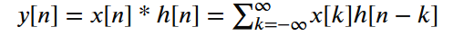
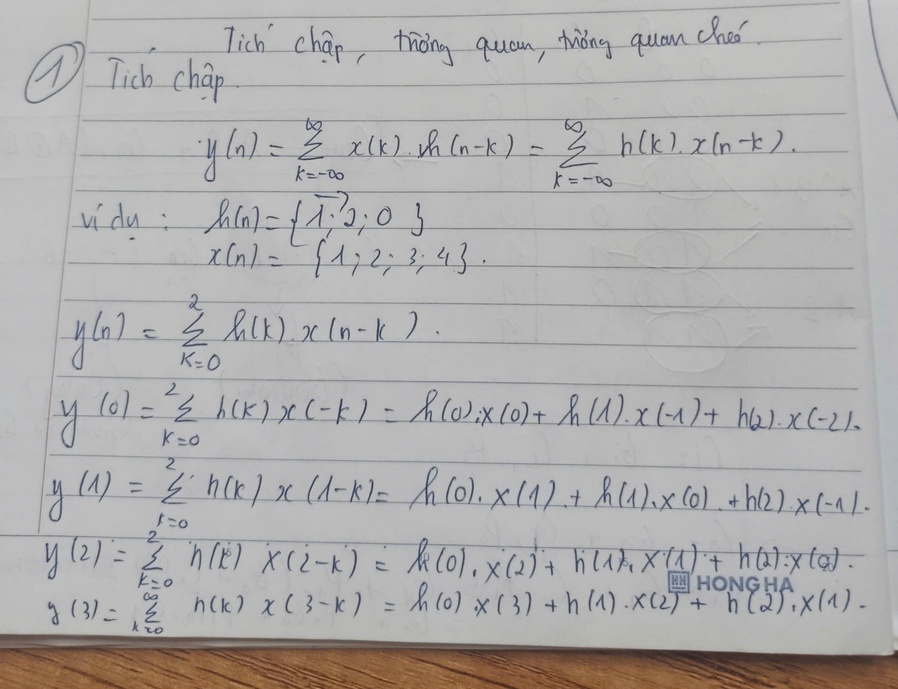
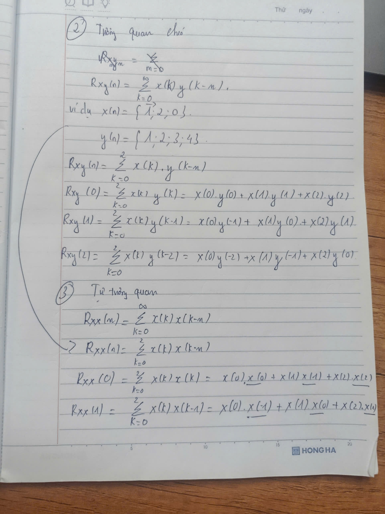

# ELE-D24-NguyenTrungHieu
# A. Kiến thức tìm hiểu
## 1. Convolution ( tích chập ) 


## 2. Tương quan chéo và tự tương quan

## B. Bài tập đã làm 
## 1. Convolution 3 taps
- code: 
```v
module convo_3taps(
    input clk,
    input rst,
    input signed [7:0] data_in,
    output reg  signed [15:0] data_out
);
    reg signed [7:0] x0, x1, x2;
    localparam signed [7:0] H0 = 8'd0;
    localparam signed [7:0] H1 = 8'd1;
    localparam signed [7:0] H2 = 8'd2;
    always @(posedge clk or posedge rst) begin
        if (rst) begin
            x0 <= 0;
            x1 <= 0;
            x2 <= 0;
        end
        else begin
            x0 <= data_in;
            x1 <= x0;
            x2 <= x1;
        end       
    end
    wire signed [15:0] prod0, prod1, prod2;
    assign prod0 = x0 * H0;
    assign prod1 = x1 * H1;
    assign prod2 = x2 * H2;
    always @(posedge clk or posedge rst) begin
        if (rst) begin
            data_out <= 0;
        end
        else begin
            data_out <= prod0 + prod1 + prod2;
        end
    end	
//	assign data_out = prod0 + prod1 + prod2;
endmodule
```
- tb: 
```v
`timescale 1ns/1ps

module tb;
    reg clk;
    reg rst;
    reg signed [7:0] data_in;
    wire signed [15:0] data_out; // 1. SỬA: Đổi từ 1-bit thành 16-bit

    // Gọi module cần test (UUT)
    convo_3taps uut(
        .clk(clk),
        .rst(rst),
        .data_in(data_in),
        .data_out(data_out)
    );

    // Tạo xung nhịp Clock chu kỳ 10ns (Tần số 100MHz)
    initial clk = 0;
    always begin
        #5 clk = !clk;
    end

    // Khối cấp kịch bản test (Stimulus)
    initial begin
        // Khởi tạo ban đầu
        rst = 1;
        data_in = 8'sd0;
        
        // Giữ reset trong 2 chu kỳ clock (20ns) cho mạch ổn định
        #20; 
        rst = 0;
        
        // 2. SỬA: Cấp dữ liệu đồng bộ theo chu kỳ 10ns 
        // (Nên thay đổi ngay sau sườn lên clock một chút để tránh race condition)
        @(posedge clk); #1 data_in = 8'sd1; // Cấp dữ liệu 1
        @(posedge clk); #1 data_in = 8'sd2; // Cấp dữ liệu 2
        @(posedge clk); #1 data_in = 8'sd3; // Cấp dữ liệu 3
        @(posedge clk); #1 data_in = 8'sd4; // Cấp dữ liệu 4
        @(posedge clk); #1 data_in = 8'sd0; // Cấp dữ liệu 0 để quan sát đuôi bộ lọc
        
        // Chờ thêm vài chu kỳ để thấy kết quả output tính toán xong rồi mới tắt
        repeat(4) @(posedge clk);
        
        $finish;
    end
    
    // Tùy chọn: Thêm dòng này nếu bạn muốn xuất giản đồ sóng ra tệp để xem (nếu dùng iVerilog/GTKWave)
    initial begin
        $dumpfile("tb.vcd");
        $dumpvars(0, tb);
    end

endmodule
```
## 2. Tương quan chéo
- code:
```v
module cr_correlation(
    input clk,
    input rst,
    input signed [7:0] data_in,
    output reg signed [17:0] r
);
    // 3 tap x(n) = 1 2 0
    localparam signed [7:0] x0 = 8'sd1;
    localparam signed [7:0] x1 = 8'sd2;
    localparam signed [7:0] x2 = 8'sd0;
    reg signed [7:0] y0,y1,y2;
    wire signed [15:0] prod0, prod1, prod2;
    always @(posedge clk or posedge rst) begin
        if (rst) begin
            y0 <= 0;
            y1 <= 0;
            y2 <= 0;
        end
        else begin
            y2 <= data_in;
            y1 <= y2;
            y0 <= y1;
        end
    end
    assign prod0 = x0 * y0;
    assign prod1 = x1 * y1;
    assign prod2 = x2 * y2;
    always @(posedge clk or posedge rst) begin
        if (rst) begin
            r <= 0;
        end
        else begin
            r <= $signed(prod0) + $signed(prod1) + $signed(prod2);
        end
    end
endmodule
```
## 3. Tự tương quan 
```v
module autocorrelation #(
    parameter WIDTH = 8,
    parameter ACC_WIDTH = 32
)(
    input clk,
    input rst,
    input en,
    input clear,

    input signed [WIDTH-1:0] data_in,

    output reg signed [ACC_WIDTH-1:0] R0,
    output reg signed [ACC_WIDTH-1:0] R1,
    output reg signed [ACC_WIDTH-1:0] R2,
    output reg signed [ACC_WIDTH-1:0] R3
);

reg signed [WIDTH-1:0] d1,d2,d3;

wire signed [2*WIDTH-1:0] p0,p1,p2,p3;

assign p0 = data_in * data_in;
assign p1 = data_in * d1;
assign p2 = data_in * d2;
assign p3 = data_in * d3;

always @(posedge clk or posedge rst)
begin
    if(rst)
    begin
        d1 <= 0;
        d2 <= 0;
        d3 <= 0;

        R0 <= 0;
        R1 <= 0;
        R2 <= 0;
        R3 <= 0;
    end
    else if(clear)
    begin
        R0 <= 0;
        R1 <= 0;
        R2 <= 0;
        R3 <= 0;
    end
    else if(en)
    begin
        // cộng dồn
        R0 <= R0 + p0;
        R1 <= R1 + p1;
        R2 <= R2 + p2;
        R3 <= R3 + p3;

        // cập nhật delay line
        d3 <= d2;
        d2 <= d1;
        d1 <= data_in;
    end
end

endmodule
```
    