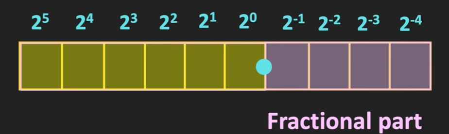
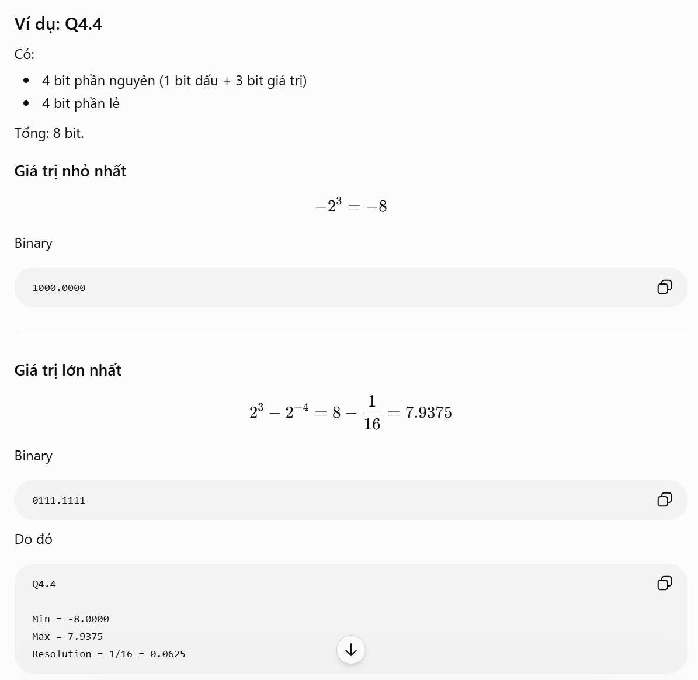
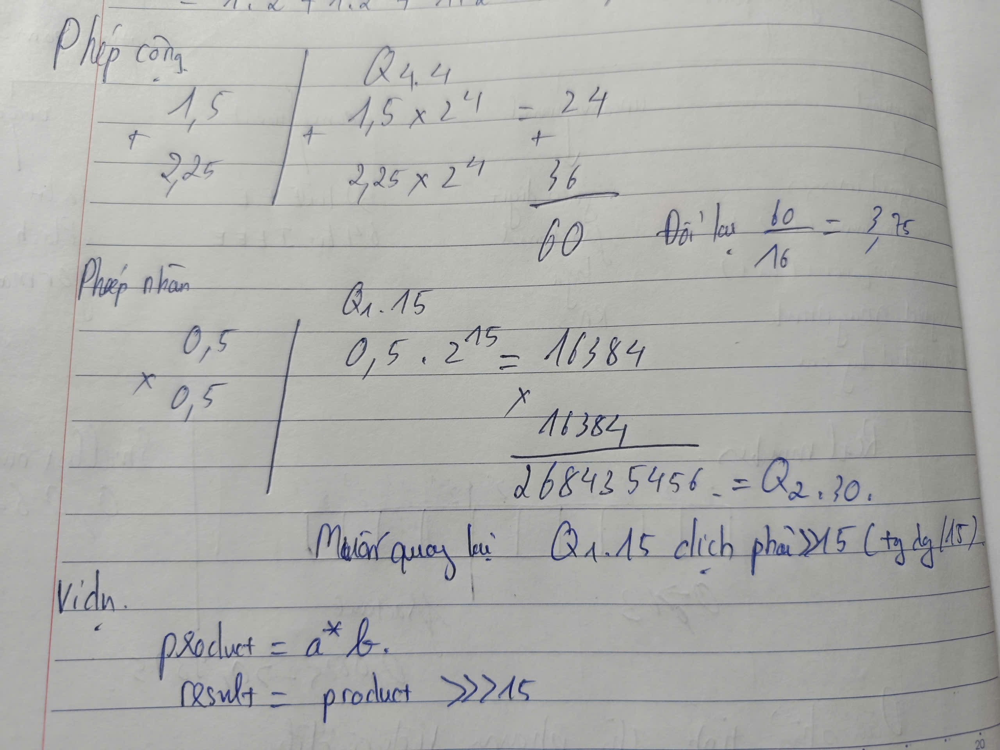
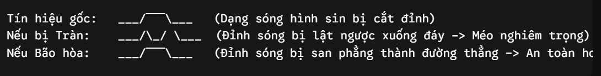
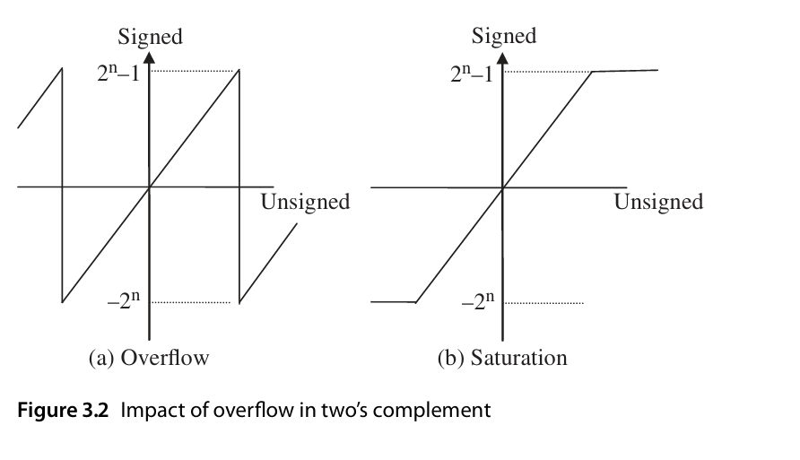

# ELE-D24-NguyenTrungHieu
# A. Kiến thức tìm hiểu
## 1. Fixed point 
### 1.1 Khái niệm và định dạng
- Fixed point (dấu phẩy tĩnh): nơi vị trí của dấu phẩy thập phân được cố định từ trước.
- Fixed point chia làm 2 phần phần thực và phần nguyên.

- Ví dụ: 
    - 8.5(d) = 00_1000.1000(b)
    - -8.5(d) = -> (bù 1) 11_0111.0111 -> (bù 2) 11_0111.1000
- Biểu diện dạng Qm.n (m là số bit phần nguyên, n là số bit phần thập phân).
- Ví dụ 1.5 biểu diễn dạng Q4.4 là 0001.1000;
    - Máy tính sẽ hiểu là 1.5 * 2^4 = 24(d) -> 0001_1000 để lưu trữ khi cần nó sẽ giải mã 24 /16 = 1.5
### 1.2 Giới hạn biểu diễn
-  Qm.n giới hạn biểu diễn sẽ là : 
    
- Ví dụ:
    
### 1.3 Cộng và nhân 2 số định dạng fixed point
- image:

### 1.4 Hiện tượng tràn số (Overflow), bão hòa (Saturation), truncation, rounding
#### 1.4.1 Overflow
- Trong FPGA các thanh ghi có kích thước cố định ví dụ 8 bit, 16 bit, nếu kết quả vượt quá giới hạn lưu trữ của số đó hiện tượng tràn bit sẽ xảy ra.
- Ví dụ trong hệ 4 bit có dấu, giá trị chạy từ -8 -> +7. Nếu lấy 7(0111) + với 1(0001) kết quả sẽ trả về 1000 trong mã bù 2 sẽ là -8
#### 1.4.2 Saturation
- Để tránh tràn số ta dùng mạch bão hòa, ta thiết kế mạch logic kiểm tra. 
    + Nếu vượt quá dương lớn nhất -> ghim giá trị ở max dương.
    + Nếu vượt quá min bé nhất -> ghim chặt giá trị ở min âm.

#### 1.4.3 Trunction
- Trong DSP, dữ liệu đi qua nhiều tầng bộ nhân bộ cộng nếu làm liên tục như vậy dữ liệu sẽ phình to do đó người ta sẽ cut giảm các bit trọng số thấp ví dụ ép 32 bit thành 16 bit
    - Ưu điểm: Cực kỳ nhanh, không tốn một cổng logic nào vì bản chất chỉ là vứt dây đi không nối nữa.
    - Nhược điểm: Tạo ra sai số thiên lệch âm (Negative DC Bias). Vì bạn luôn vứt bỏ phần lẻ, con số thực tế luôn bị kéo ghì về phía nhỏ hơn (ví dụ: 1.99 cắt cụt thành 1.0). Trong các vòng lặp DSP dài, sai số này sẽ tích lũy và làm lệch toàn bộ hệ thống.
#### 1.4.4 Rounding
-  Để khắc phục nhược điểm "thiên lệch âm" của Truncation, người ta dùng Rounding (Làm tròn về số gần nhất).
- Quy tắc: sẽ cộng thêm nửa đơn vị vào bit giữ lại cuối cùng, rồi mới tiến hành truncation.
- Ví dụ: Giả sử bạn có số 1.75 dạng nhị phân là 1.11 (1 bit nguyên, 2 bit phân số). Bạn muốn thu gọn về định dạng chỉ có 1 bit phân số.
    - Nếu dùng Truncation: Cắt phăng bit cuối cùng $\rightarrow$ 1.1 (tương đương 1.5). Sai số là: $1.75 - 1.5 = 0.25$.
    - Nếu dùng Rounding: 1. Cộng thêm 0.01 (vốn là hằng số đại diện cho 0.5 của bit chuẩn bị cắt).
    2. Phép tính: 1.11 + 0.01 = 10.00 (tương đương số 2).
    3. Cắt bit cuối $\rightarrow$ Kết quả ra 2.0.
    4. Sai số là: $2.0 - 1.75 = 0.25$. Vì số 1.75 gần số 2.0 hơn số 1.5, nên kết quả này chính xác hơn về mặt toán học.
    - Ưu điểm: Tín hiệu mượt, triệt tiêu sai số DC bias, cải thiện tỷ số tín hiệu trên nhiễu (SNR) của bộ lọc.
    - Nhược điểm: Tốn thêm tài nguyên phần cứng vì phải chèn thêm một Bộ cộng (Adder) trước khi cắt bit.
## Multipation
